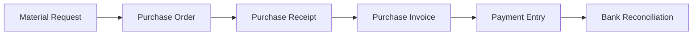

## Overview

The Accounting module in ERPNext provides comprehensive financial management capabilities for businesses of all sizes. It handles everything from chart of accounts to financial statements, ensuring compliance and accurate financial tracking.

## Key Features

### Chart of Accounts

Manage your company's financial structure with a flexible hierarchical chart of accounts.

<CardGroup cols={2}>
  <Card title="Account Types" icon="folder-tree">
    - Asset Accounts
    - Liability Accounts
    - Income Accounts
    - Expense Accounts
    - Equity Accounts
  </Card>
  <Card title="Multi-Company" icon="building">
    Support for multiple companies with separate books of accounts
  </Card>
</CardGroup>

### Core Doctypes

<Accordion title="Journal Entry">
  The fundamental accounting transaction for recording debits and credits.

  **Key Features:**
  - Multi-currency support
  - Inter-company transactions
  - Tax withholding entries
  - Opening entries
  - Deferred accounting

  ```python
  # From journal_entry.py
  class JournalEntry(AccountsController):
      voucher_type: Literal[
          "Journal Entry",
          "Inter Company Journal Entry",
          "Bank Entry",
          "Cash Entry",
          "Credit Card Entry",
          "Debit Note",
          "Credit Note",
          "Contra Entry",
          "Excise Entry",
          "Write Off Entry",
          "Opening Entry",
          "Depreciation Entry",
          "Exchange Rate Revaluation",
          "Exchange Gain Or Loss",
          "Deferred Revenue",
          "Deferred Expense"
      ]
  ```
</Accordion>

<Accordion title="Sales Invoice">
  Create and manage customer invoices with automatic accounting entries.

  **Features:**
  - Multiple payment terms
  - Advance payment allocation
  - Return/credit notes
  - POS integration
  - E-invoicing support
</Accordion>

<Accordion title="Purchase Invoice">
  Record supplier bills and manage payables.

  **Features:**
  - Bill-based booking
  - TDS/Tax withholding
  - Item-wise taxation
  - Deferred expenses
  - Auto-repeat for recurring bills
</Accordion>

<Accordion title="Payment Entry">
  Record payments and receipts with automatic reconciliation.

  **Capabilities:**
  - Multi-mode payments
  - Payment reconciliation
  - Advance payments
  - Bank integration
  - Currency exchange handling
</Accordion>

## Financial Reports

<Note>
  ERPNext provides real-time financial reports that update automatically as transactions are posted.
</Note>

### Available Reports

| Report | Purpose |
|--------|----------|
| **General Ledger** | Detailed view of all accounting transactions |
| **Trial Balance** | Verify debit-credit balance |
| **Profit & Loss Statement** | Income and expense summary |
| **Balance Sheet** | Assets, liabilities, and equity position |
| **Cash Flow Statement** | Track cash inflows and outflows |
| **Accounts Receivable** | Outstanding customer invoices |
| **Accounts Payable** | Outstanding supplier bills |

## Bank Reconciliation

Streamline bank reconciliation with automated matching:

<Steps>
  <Step title="Import Bank Statement">
    Upload bank statements in CSV, Excel, or OFX format
  </Step>
  <Step title="Auto-Match Transactions">
    System automatically matches bank entries with payment entries
  </Step>
  <Step title="Reconcile Differences">
    Review and reconcile unmatched transactions
  </Step>
  <Step title="Generate Report">
    View reconciliation status and outstanding items
  </Step>
</Steps>

## Multi-Currency Support

Handle international transactions seamlessly:

- Define exchange rates manually or fetch automatically
- Multi-currency accounts
- Exchange gain/loss calculation
- Conversion to base currency

<Tip>
  ERPNext supports unlimited currencies and automatically handles exchange rate fluctuations.
</Tip>

## Tax Management

### Tax Templates

Create reusable tax templates for different scenarios:

- Sales Taxes and Charges
- Purchase Taxes and Charges
- Item Tax Templates
- Tax Withholding Categories (TDS/TCS)

### Tax Features

<CardGroup cols={2}>
  <Card title="GST Compliance" icon="file-invoice">
    Full support for GST with GSTR reports
  </Card>
  <Card title="VAT Support" icon="percent">
    Handle VAT, reverse charge, and tax exemptions
  </Card>
  <Card title="TDS/TCS" icon="hand-holding-dollar">
    Automatic tax withholding calculation
  </Card>
  <Card title="Tax Reports" icon="chart-bar">
    Detailed tax reports for compliance
  </Card>
</CardGroup>

## Cost Centers and Budgets

### Cost Center Tracking

Allocate transactions to cost centers for departmental accounting:

- Hierarchical cost center structure
- Distributed cost centers
- Cost center-wise reports
- Profit center analysis

### Budget Control

Set and monitor budgets:

- Monthly/quarterly/yearly budgets
- Account-wise budgets
- Cost center-wise budgets
- Budget variance analysis
- Alert on budget overrun

## Deferred Accounting

Manage deferred revenue and expenses:

<Accordion title="Deferred Revenue">
  Recognize revenue over time for subscription-based services:
  - Define deferred revenue accounts
  - Automatic monthly booking
  - Deferred revenue reports
</Accordion>

<Accordion title="Deferred Expenses">
  Spread expenses over multiple periods:
  - Prepaid expense booking
  - Automatic amortization
  - Expense recognition reports
</Accordion>

## Payment Integration

Integrate with payment gateways:

- Razorpay
- Stripe
- PayPal
- Braintree
- Paytm

<Note>
  Online payment links can be sent directly from invoices for faster collection.
</Note>

## Period Closing

Close accounting periods to prevent backdated entries:

1. Set accounting period start and end dates
2. Define roles that can override
3. Lock periods after audit
4. Generate period closing entries

## Key Workflows

### Sales to Payment Flow


### Purchase to Payment Flow



<Tip>
  All financial transactions automatically update the general ledger in real-time, ensuring accurate financial position at any moment.
</Tip>
