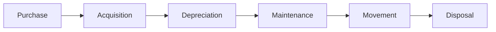

## Overview

The Assets module helps you manage your organization's fixed assets throughout their lifecycle. Track asset acquisition, calculate depreciation, schedule maintenance, record movements, and handle disposal.

## Key Features

### Asset Lifecycle Management

Comprehensive tracking from acquisition to disposal:

<CardGroup cols={2}>
  <Card title="Acquisition" icon="cart-plus">
    - Purchase-based
    - Direct entry
    - Asset capitalization
    - Initial valuation
  </Card>
  <Card title="Disposal" icon="trash">
    - Sale of asset
    - Scrapping
    - Gain/loss calculation
    - Accounting entries
  </Card>
</CardGroup>

## Core Doctypes

<Accordion title="Asset">
  The main record for fixed assets.

  ```python
  # From asset.py
  class Asset(AccountsController):
      status: Literal[
          "Draft",
          "Submitted",
          "Partially Depreciated",
          "Fully Depreciated",
          "Sold",
          "Scrapped",
          "In Maintenance",
          "Out of Order",
          "Issue",
          "Receipt",
          "Capitalized",
          "Decapitalized"
      ]
      asset_owner: Literal[
          "Company",
          "Supplier",
          "Customer"
      ]
  ```

  **Asset Information:**
  - Asset name and category
  - Item code linkage
  - Location tracking
  - Custodian assignment
  - Purchase details
  - Available for use date
  - Gross purchase amount
  - Asset quantity

  **Depreciation:**
  - Multiple finance books
  - Depreciation method
  - Frequency and schedules
  - Accumulated depreciation
  - Net book value

  <Note>
    Assets can be linked to purchase invoices for automatic creation from purchased items.
  </Note>
</Accordion>

<Accordion title="Asset Category">
  Define asset classifications and default settings.

  **Category Settings:**
  - Depreciation method (Straight Line, Double Declining Balance, Written Down Value, Manual)
  - Total number of depreciations
  - Frequency of depreciation (Monthly, Quarterly, Half-Yearly, Yearly)
  - Default accounts (asset, depreciation, accumulated depreciation)
  - Cost center allocation

  **Account Mapping:**
  - Company-wise account setup
  - Asset account
  - Accumulated depreciation account
  - Depreciation expense account
  - Capital work in progress account
</Accordion>

<Accordion title="Asset Depreciation Schedule">
  Automated depreciation calculation and posting.

  **Schedule Features:**
  - Auto-calculated depreciation
  - Date-wise schedule
  - Posted vs draft entries
  - Depreciation amount
  - Accumulated depreciation
  - Net book value

  **Posting:**
  - Automatic journal entry creation
  - Scheduled posting
  - Batch depreciation posting
  - Finance book support
</Accordion>

<Accordion title="Asset Maintenance">
  Schedule and track maintenance activities.

  **Maintenance Planning:**
  - Preventive maintenance tasks
  - Maintenance frequency
  - Start and end dates
  - Maintenance team assignment
  - Certificate required

  **Maintenance Log:**
  - Actual maintenance date
  - Completion status
  - Task description
  - Actions performed
  - Certificate attachment
</Accordion>

## Depreciation Methods

Support for multiple depreciation calculations:

### Straight Line Method

```python
Annual Depreciation = (Purchase Amount - Salvage Value) / Useful Life
Monthly Depreciation = Annual Depreciation / 12
```

**Characteristics:**
- Equal depreciation each period
- Simple calculation
- Most common method

### Double Declining Balance

```python
Depreciation Rate = (2 / Useful Life) × 100%
Period Depreciation = Net Book Value × Depreciation Rate
```

**Characteristics:**
- Accelerated depreciation
- Higher depreciation in early years
- Asset value declines faster

### Written Down Value

```python
Depreciation = Net Book Value × Depreciation Rate
```

**Characteristics:**
- Similar to declining balance
- Percentage of book value
- Never fully depreciates to zero

### Manual Method

Manually enter depreciation amounts for each period.

<Tip>
  Choose depreciation method based on asset type, tax requirements, and accounting standards.
</Tip>

## Asset Acquisition

Multiple ways to acquire assets:

### Purchase-Based Acquisition

<Steps>
  <Step title="Purchase Item">
    Create purchase invoice for capital item
  </Step>
  <Step title="Auto Asset Creation">
    System creates asset automatically if item is capital asset
  </Step>
  <Step title="Set Available Date">
    Specify when asset is available for use
  </Step>
  <Step title="Start Depreciation">
    Depreciation begins from available-for-use date
  </Step>
</Steps>

### Asset Capitalization

Create asset from multiple components:

- **Stock items**: Consume inventory items
- **Service items**: Add service costs
- **Existing assets**: Combine multiple assets
- **Total capitalization**: Sum of all components

**Use Cases:**
- Building construction
- Machine assembly
- Equipment upgrades

## Asset Movement

Track asset location and custody changes:

### Movement Types

<CardGroup cols={2}>
  <Card title="Transfer" icon="arrows-left-right">
    - Location change
    - No change in value
    - Update location field
  </Card>
  <Card title="Issue/Receipt" icon="right-left">
    - Issue to employee/customer
    - Return receipt
    - Track custodian
  </Card>
</CardGroup>

### Movement Workflow

1. **Create Asset Movement**: Specify movement type and target location
2. **Add Assets**: Select assets to move
3. **Set Date**: Effective date of movement
4. **Submit**: Execute movement and update asset records

<Note>
  Asset movements maintain complete history of location changes for audit purposes.
</Note>

## Asset Maintenance Management

### Preventive Maintenance

Schedule regular maintenance:

**Setup:**
- Define maintenance tasks
- Set frequency (Weekly, Monthly, Quarterly, Yearly)
- Assign maintenance team
- Set start and end dates

**Execution:**
- System generates maintenance schedule
- Email reminders before due date
- Record maintenance logs
- Attach certificates

### Maintenance Team

Organize maintenance resources:

- **Team name**: Maintenance crew identifier
- **Team members**: Assign employees
- **Manager**: Team lead
- **Maintenance schedule**: Track assigned tasks

### Asset Repair

Record breakdown repairs:

**Repair Details:**
- Failure date
- Error description
- Repair cost
- Downtime duration
- Actions taken
- Completion status

**Cost Tracking:**
- Parts/items consumed
- Link purchase invoices
- Capitalize major repairs
- Expense minor repairs

## Asset Value Adjustment

Adjust asset value for various reasons:

**Adjustment Types:**
- Revaluation
- Impairment
- Write-up
- Correction

**Process:**
1. Create Asset Value Adjustment
2. Enter current and new value
3. Provide reason for adjustment
4. Submit to create journal entry

<Accordion title="Accounting Impact">
  ```
  # For revaluation increase
  Asset Account Dr.
      To Asset Revaluation Reserve Cr.

  # For impairment
  Impairment Loss Dr.
      To Accumulated Depreciation Cr.
  ```
</Accordion>

## Asset Disposal

Handle asset retirement:

### Disposal Methods

1. **Sale**: Sell asset to third party
2. **Scrap**: Dispose as scrap
3. **Write-off**: Remove obsolete asset

### Disposal Process

<Steps>
  <Step title="Record Disposal">
    Set disposal date in asset record
  </Step>
  <Step title="Calculate Gain/Loss">
    System calculates based on sale value vs book value
  </Step>
  <Step title="Journal Entry">
    Automatic accounting entry for disposal
  </Step>
  <Step title="Update Status">
    Asset marked as sold/scrapped
  </Step>
</Steps>

### Disposal Accounting

```python
# For asset sale
Gain/Loss = Sale Value - Net Book Value

# Journal Entry
Bank Account Dr. (Sale Value)
Accumulated Depreciation Dr.
Loss on Disposal Dr. (if loss)
    To Asset Account Cr.
    To Gain on Disposal Cr. (if gain)
```

## Asset Shift Management

Manage assets used in multiple shifts:

### Shift Configuration

- **Shift name**: Shift identifier
- **Start and end time**: Shift hours
- **Shift factor**: Depreciation multiplier

### Shift Allocation

- Assign asset to shifts
- Calculate depreciation per shift
- Track usage intensity
- Accelerated depreciation for multi-shift

<Note>
  Assets used in multiple shifts depreciate faster due to higher utilization.
</Note>

## Asset Reports

<Accordion title="Fixed Asset Register">
  Complete asset listing:
  - All active assets
  - Purchase details
  - Current value
  - Accumulated depreciation
  - Net book value
  - Location and custodian
</Accordion>

<Accordion title="Asset Depreciation Ledger">
  Depreciation history:
  - Period-wise depreciation
  - Posted entries
  - Pending entries
  - Finance book-wise view
</Accordion>

<Accordion title="Asset Maintenance Report">
  Maintenance tracking:
  - Scheduled maintenance
  - Completed maintenance
  - Overdue maintenance
  - Maintenance cost
</Accordion>

<Accordion title="Asset Activity Report">
  Complete asset transaction history:
  - All movements
  - All adjustments
  - All repairs
  - Complete audit trail
</Accordion>

## Finance Books

Maintain multiple depreciation schedules:

**Use Cases:**
- **Tax book**: For tax purposes
- **IFRS book**: For financial reporting
- **Management book**: For internal purposes

**Features:**
- Different depreciation methods per book
- Different useful lives
- Independent schedules
- Separate GL entries

<Tip>
  Use multiple finance books to comply with different accounting standards simultaneously.
</Tip>

## Asset Insurance

Track insurance coverage:

**Insurance Details:**
- Policy number
- Insurer name
- Insured value
- Comprehensive insurance
- Start and end dates
- Premium amount

**Benefits:**
- Insurance expiry alerts
- Coverage tracking
- Claim management

## Asset Location Management

### Location Tracking

- Hierarchical location structure
- GPS coordinates
- Physical address
- Location description
- Linked locations (parent-child)

### Benefits

- Quick asset location
- Physical verification
- Movement tracking
- Stock take organization

## Asset Settings

Configure asset management:

| Setting | Description |
|---------|-------------|
| **Asset Depreciation Posting** | Accounting entry on depreciation |
| **Schedule Depreciation** | Auto-post scheduled depreciation |
| **Default Finance Book** | Primary finance book |
| **Enable Capital Work in Progress** | Track CWIP |
| **Enable Asset Maintenance** | Activate maintenance module |

## Key Workflows

### Standard Asset Lifecycle



### Depreciation Workflow

<Steps>
  <Step title="Asset Available for Use">
    Set available-for-use date
  </Step>
  <Step title="Generate Schedule">
    System creates depreciation schedule
  </Step>
  <Step title="Review Schedule">
    Verify depreciation amounts
  </Step>
  <Step title="Post Depreciation">
    Manual or automatic posting
  </Step>
  <Step title="Update Asset Value">
    Net book value updated automatically
  </Step>
</Steps>

<Tip>
  The Assets module ensures accurate asset tracking, proper depreciation calculation, and compliance with accounting standards.
</Tip>
