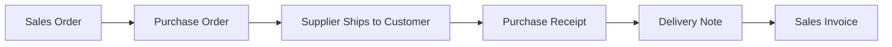

## Overview

The Buying module helps you manage the entire procurement cycle from supplier selection to goods receipt. It provides tools for vendor management, purchase planning, order tracking, and supplier performance evaluation.

## Key Features

### Supplier Management

Maintain comprehensive supplier records:

<CardGroup cols={2}>
  <Card title="Supplier Database" icon="address-book">
    - Contact details
    - Payment terms
    - Credit limits
    - Tax information
  </Card>
  <Card title="Supplier Portal" icon="globe">
    Allow suppliers to view RFQs and submit quotations online
  </Card>
</CardGroup>

## Core Doctypes

<Accordion title="Purchase Order">
  The primary document for ordering goods and services from suppliers.

  ```python
  # From purchase_order.py
  class PurchaseOrder(BuyingController):
      status: Literal[
          "Draft",
          "To Receive and Bill",
          "To Bill",
          "To Receive",
          "Completed",
          "Cancelled",
          "Closed",
          "On Hold"
      ]
  ```

  **Key Features:**
  - Multi-item ordering
  - Partial receipts
  - Drop shipping
  - Blanket orders for recurring purchases
  - Quality inspection integration
  - Subcontracting support

  <Note>
    Purchase orders can be created directly or auto-generated from Material Requests.
  </Note>
</Accordion>

<Accordion title="Request for Quotation (RFQ)">
  Send RFQs to multiple suppliers and compare quotes.

  **Process:**
  1. Create RFQ with required items
  2. Send to multiple suppliers via email
  3. Suppliers submit quotations online
  4. Compare quotations side-by-side
  5. Create purchase orders from selected quotes

  <Tip>
    The supplier quotation comparison tool helps you select the best supplier based on price, delivery time, and other factors.
  </Tip>
</Accordion>

<Accordion title="Supplier Quotation">
  Record quotations received from suppliers.

  **Features:**
  - Link to RFQ
  - Multiple items
  - Valid until date
  - Terms and conditions
  - Convert to Purchase Order
</Accordion>

<Accordion title="Purchase Receipt">
  Record goods received from suppliers.

  **Capabilities:**
  - Quality inspection
  - Batch and serial number tracking
  - Rejected quantity handling
  - Return against purchase receipt
  - Barcode scanning

  **Impact:**
  - Updates stock levels
  - Creates accounting entries (if perpetual inventory)
  - Updates purchase order status
</Accordion>

## Material Request Workflow

Initiate the procurement process with material requests:

<Steps>
  <Step title="Create Material Request">
    Department/user requests materials needed
  </Step>
  <Step title="Approval">
    Route for approval based on amount
  </Step>
  <Step title="Generate Purchase Order">
    Auto-create PO from approved material requests
  </Step>
  <Step title="Track Status">
    Monitor ordered, received, and pending quantities
  </Step>
</Steps>

## Supplier Scorecard

Evaluate supplier performance systematically:

### Scoring Criteria

<CardGroup cols={2}>
  <Card title="Quality" icon="award">
    - Acceptance rate
    - Rejection rate
    - Quality inspection results
  </Card>
  <Card title="Delivery" icon="truck">
    - On-time delivery
    - Lead time accuracy
    - Order completeness
  </Card>
  <Card title="Cost" icon="dollar-sign">
    - Price competitiveness
    - Payment terms
    - Total cost of ownership
  </Card>
  <Card title="Service" icon="headset">
    - Communication
    - Issue resolution
    - Flexibility
  </Card>
</CardGroup>

### Scorecard Features

```python
# Supplier scoring variables
- On-time delivery percentage
- Quality inspection pass rate
- Response time to RFQs
- Price variance from budget
- Lead time adherence
```

<Note>
  Supplier scorecards help you make data-driven decisions about supplier selection and relationship management.
</Note>

## Subcontracting

Manage subcontracting operations where suppliers manufacture items using your raw materials:

<Accordion title="Subcontracting Process">
  1. **Setup**: Define subcontracting BOM
  2. **Purchase Order**: Create PO with subcontracting items
  3. **Material Transfer**: Transfer raw materials to supplier
  4. **Receipt**: Receive finished goods from supplier
  5. **Accounting**: System handles complex cost accounting

  **Tracking:**
  - Raw materials with supplier
  - Finished goods received
  - Cost allocation
  - Material consumption
</Accordion>

## Buying Settings

Customize the buying module behavior:

### Configuration Options

| Setting | Description |
|---------|-------------|
| **Supplier Naming** | Auto-naming or manual naming |
| **PO Required** | Make purchase order mandatory |
| **PR Required** | Require purchase receipt before invoice |
| **Maintain Stock** | Enable/disable stock tracking |
| **Default Buying Price List** | Default price list for purchases |
| **Allow Multiple Items** | Allow same item multiple times in transaction |
| **Backflush Raw Materials** | Auto-consume materials on receipt |

## Purchase Analytics

Gain insights into your procurement operations:

### Key Reports

<Accordion title="Purchase Order Analysis">
  Track purchase order trends and status:
  - PO value by supplier
  - PO aging analysis
  - Pending orders
  - Delivery performance
</Accordion>

<Accordion title="Purchase Analytics">
  Visual analytics for purchase trends:
  - Monthly purchase trends
  - Category-wise spend
  - Supplier-wise analysis
  - Item-wise purchase history
</Accordion>

<Accordion title="Procurement Tracker">
  Complete view of procurement pipeline:
  - Material request to PO
  - PO to receipt status
  - Receipt to invoice status
  - Payment status
</Accordion>

## Price Lists and Item Prices

Manage purchase pricing:

- **Supplier-wise pricing**: Different prices for different suppliers
- **Quantity-based pricing**: Volume discounts
- **Time-bound prices**: Valid from/to dates
- **Party-specific items**: Items supplied by specific suppliers only

<Tip>
  The system automatically fetches the last purchase rate when creating new purchase documents.
</Tip>

## Purchase Taxes and Charges

Handle complex tax scenarios:

- Multiple tax templates
- Item-wise taxation
- Tax withholding (TDS)
- Reverse charge
- Customs and import duties
- Shipping and handling charges

## Blanket Orders

Set up recurring purchase agreements:

**Use Cases:**
- Annual supply contracts
- Rate contracts
- Consumable items
- Regular services

**Features:**
- Validity period
- Maximum quantity/amount
- Order against blanket order
- Quantity tracking

<Note>
  Blanket orders help you negotiate better prices for bulk quantities while making purchases as needed.
</Note>

## Drop Shipping

Handle direct shipment from supplier to customer:



**Benefits:**
- Reduce inventory holding
- Faster fulfillment
- Lower logistics costs

## Quality Inspection

Integrate quality checks in the procurement process:

- **Inspection before receipt**: Inspect goods before accepting
- **Sample-based inspection**: Check sample quantities
- **Parameter-based**: Define quality parameters
- **Accept/Reject**: Automated acceptance based on results

## Key Workflows

### Standard Purchase Flow

<Steps>
  <Step title="Material Request">
    User requests materials
  </Step>
  <Step title="Request for Quotation">
    Send RFQ to suppliers
  </Step>
  <Step title="Compare Quotations">
    Evaluate supplier quotations
  </Step>
  <Step title="Purchase Order">
    Create PO for selected supplier
  </Step>
  <Step title="Purchase Receipt">
    Receive goods and update stock
  </Step>
  <Step title="Purchase Invoice">
    Book supplier bill
  </Step>
  <Step title="Payment">
    Make payment to supplier
  </Step>
</Steps>

<Tip>
  The buying module integrates seamlessly with accounts and stock modules to provide end-to-end procurement visibility.
</Tip>
