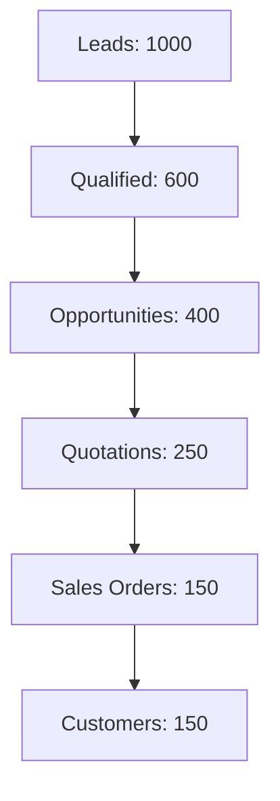

## Overview

The CRM module helps you manage the entire customer lifecycle from lead generation to conversion. It provides tools for lead management, opportunity tracking, campaign management, and sales pipeline analysis.

## Key Features

### Lead Management

Capture and nurture potential customers:

<CardGroup cols={2}>
  <Card title="Lead Capture" icon="user-plus">
    - Web forms
    - Email integration
    - Manual entry
    - Import from spreadsheet
  </Card>
  <Card title="Lead Qualification" icon="filter">
    - Qualification status
    - Lead scoring
    - Auto-assignment
    - Conversion tracking
  </Card>
</CardGroup>

## Core Doctypes

<Accordion title="Lead">
  Potential customers who have shown interest.

  ```python
  # From lead.py
  class Lead(SellingController, CRMNote):
      status: Literal[
          "Lead",
          "Open",
          "Replied",
          "Opportunity",
          "Quotation",
          "Lost Quotation",
          "Interested",
          "Converted",
          "Do Not Contact"
      ]
      qualification_status: Literal[
          "Unqualified",
          "In Process",
          "Qualified"
      ]
  ```

  **Lead Information:**
  - Contact details (name, email, phone)
  - Company information
  - Lead source and campaign
  - Territory and market segment
  - Qualification status
  - Notes and communication history

  **Lead Conversion:**
  - Convert to Customer
  - Convert to Opportunity
  - Convert to Quotation
  - Automatic linking of related documents

  <Note>
    Leads can be automatically captured from your website using web forms.
  </Note>
</Accordion>

<Accordion title="Opportunity">
  Qualified sales opportunities with potential revenue.

  **Opportunity Features:**
  - Link to customer or lead
  - Opportunity amount
  - Probability of winning
  - Expected closing date
  - Sales stage tracking
  - Competitor information
  - Items/products of interest
  - Lost reason (if unsuccessful)

  **Sales Stages:**
  - Prospecting
  - Qualification
  - Needs Analysis
  - Value Proposition
  - Negotiation
  - Closed Won/Lost

  **Conversion:**
  - Create quotation from opportunity
  - Track quotation status
  - Link to sales orders
</Accordion>

<Accordion title="Customer">
  Converted leads who have made purchases.

  **Customer Details:**
  - Basic information
  - Customer group
  - Territory
  - Credit limit and payment terms
  - Primary contact
  - Multiple addresses
  - Loyalty program
  - Customer portal access

  **Customer Segmentation:**
  - By geography (territory)
  - By industry (customer group)
  - By market segment
  - By size/revenue
</Accordion>

<Accordion title="Prospect">
  A middle stage between lead and customer for B2B scenarios.

  **Features:**
  - Link multiple leads
  - Link multiple opportunities
  - Company-level tracking
  - Organization hierarchy
  - Decision maker identification
</Accordion>

## Campaign Management

Plan and track marketing campaigns:

### Campaign Setup

<Steps>
  <Step title="Create Campaign">
    Define campaign name, start/end date, and budget
  </Step>
  <Step title="Set Target Audience">
    Define lead sources and expected leads
  </Step>
  <Step title="Execute Campaign">
    Email campaigns, events, advertisements
  </Step>
  <Step title="Track Results">
    Monitor leads generated and conversion rate
  </Step>
</Steps>

### Email Campaigns

Automate email outreach:

- **Email templates**: Reusable email content
- **Email scheduling**: Send at optimal times
- **Unsubscribe handling**: Respect opt-outs
- **Campaign tracking**: Open and click rates
- **Lead scoring**: Based on engagement

<Tip>
  Link leads to campaigns to track which marketing efforts generate the best results.
</Tip>

## Appointment Booking

Schedule meetings with prospects:

### Appointment Features

- **Online booking**: Customers book via website
- **Availability slots**: Define available time slots
- **Email confirmation**: Automatic notifications
- **Calendar integration**: Sync with user calendar
- **Lead creation**: Auto-create lead from appointment

### Appointment Settings

<CardGroup cols={2}>
  <Card title="Scheduling" icon="calendar">
    - Available days and times
    - Appointment duration
    - Advance booking period
    - Number of agents
  </Card>
  <Card title="Notifications" icon="bell">
    - Confirmation emails
    - Reminder emails
    - Success message
    - Email templates
  </Card>
</CardGroup>

## Sales Pipeline

Visualize and manage your sales process:

### Pipeline View

- **Kanban board**: Drag and drop opportunities
- **Stage-wise grouping**: See opportunities by stage
- **Value summary**: Total pipeline value
- **Probability weighting**: Expected revenue calculation

### Pipeline Metrics

```python
# Key metrics
Pipeline Value = Sum of all opportunity amounts
Weighted Value = Sum of (opportunity amount × probability)
Average Deal Size = Total Value / Number of Opportunities
Conversion Rate = Won Opportunities / Total Opportunities
Average Sales Cycle = Average days from creation to close
```

## Sales Stage Management

Define your sales process:

**Standard Sales Stages:**
1. **Prospecting**: Initial contact
2. **Qualification**: Assess fit and need
3. **Needs Analysis**: Understand requirements
4. **Proposal**: Present solution
5. **Negotiation**: Discuss terms
6. **Closed Won**: Deal successful
7. **Closed Lost**: Deal unsuccessful

<Note>
  Customize sales stages to match your specific sales process.
</Note>

## Contract Management

Manage customer contracts:

### Contract Features

<Accordion title="Contract Details">
  - Contract start and end dates
  - Signatory information
  - Contract value
  - Terms and conditions
  - Fulfillment checklist
  - Auto-renewal settings
  - Signed contract attachment
</Accordion>

<Accordion title="Contract Tracking">
  - Status (Unsigned, Active, Inactive)
  - Expiry alerts
  - Renewal reminders
  - Amendment tracking
  - Linked sales orders/invoices
</Accordion>

### Contract Templates

Standardize contract creation:

- Pre-defined terms and conditions
- Fulfilment checklist templates
- Standard clauses
- Quick contract generation

## CRM Reports and Analytics

<Accordion title="Sales Pipeline Analytics">
  Analyze sales pipeline health:
  - Stage-wise opportunity distribution
  - Pipeline value trends
  - Conversion rates by stage
  - Average time in each stage
  - Win/loss ratio
</Accordion>

<Accordion title="Lead Conversion Analysis">
  Track lead effectiveness:
  - Lead-to-opportunity conversion
  - Opportunity-to-quotation conversion
  - Quotation-to-order conversion
  - Overall lead-to-customer conversion
  - Average conversion time
</Accordion>

<Accordion title="Campaign Efficiency">
  Measure campaign ROI:
  - Leads generated per campaign
  - Cost per lead
  - Conversion rate by campaign
  - Revenue attributed to campaign
  - Campaign ROI calculation
</Accordion>

<Accordion title="Lost Opportunity Report">
  Understand why deals are lost:
  - Lost reasons breakdown
  - Competitor analysis
  - Lost opportunity trends
  - Value of lost opportunities
</Accordion>

<Accordion title="Lead Owner Efficiency">
  Track sales team performance:
  - Leads by owner
  - Conversion rates
  - Average response time
  - Revenue per owner
  - Activity metrics
</Accordion>

## Lead Sources

Track where leads come from:

**Common Lead Sources:**
- Website
- Campaign
- Email inquiry
- Cold calling
- Exhibition
- Customer referral
- Partner referral
- Walk-in
- Social media

### UTM Tracking

Capture marketing attribution:

- **utm_source**: Referring site (google, facebook)
- **utm_medium**: Marketing medium (cpc, email, social)
- **utm_campaign**: Campaign name
- **utm_content**: Ad variation

<Tip>
  Use UTM parameters in your marketing links to automatically track lead sources in ERPNext.
</Tip>

## Communication Tracking

Maintain complete communication history:

**Features:**
- Email integration
- Email threading
- Send emails from ERPNext
- Link emails to leads/opportunities
- Communication timeline
- Attachment tracking

## Notes and Activities

Track interactions and next steps:

### CRM Notes

- Add notes to leads, opportunities, customers
- Private or shared notes
- Activity logging
- Follow-up reminders

### Task Integration

- Create tasks from CRM records
- Set follow-up tasks
- Task assignment
- Due date tracking

## Competitor Tracking

Monitor competitive landscape:

**Competitor Information:**
- Competitor name and website
- Products/services offered
- Strengths and weaknesses
- Lost opportunities to competitor
- Win rate against competitor

## Market Segment

Segment your target market:

**Examples:**
- Small Business
- Mid-Market
- Enterprise
- Government
- Non-profit

**Use Cases:**
- Targeted marketing
- Custom pricing
- Specialized offerings
- Sales strategy alignment

## CRM Settings

Configure CRM behavior:

| Setting | Description |
|---------|-------------|
| **Default Lead Status** | Initial status for new leads |
| **Close Opportunity After** | Days to auto-close stale opportunities |
| **Auto Creation of Contact** | Auto-create contact from lead |
| **Campaign Naming** | Auto-naming series |

## Sales Funnel

Visualize conversion rates:



**Funnel Metrics:**
- Lead to opportunity: 40%
- Opportunity to quotation: 62.5%
- Quotation to order: 60%
- Overall conversion: 15%

## CRM Workflow

### Standard Lead-to-Customer Flow

<Steps>
  <Step title="Lead Capture">
    Capture lead from website, campaign, or manual entry
  </Step>
  <Step title="Lead Qualification">
    Assess lead quality and mark as qualified
  </Step>
  <Step title="Create Opportunity">
    Convert qualified lead to sales opportunity
  </Step>
  <Step title="Send Quotation">
    Prepare and send quotation
  </Step>
  <Step title="Follow Up">
    Track communication and follow up
  </Step>
  <Step title="Close Deal">
    Convert to sales order and customer
  </Step>
</Steps>

### First Response Time

Track how quickly leads are contacted:

- **First Response Time**: Time from lead creation to first communication
- **Target SLA**: Set target response time
- **Performance tracking**: Monitor team response times
- **Alerts**: Notify on SLA breach

<Note>
  Fast response times significantly improve lead conversion rates.
</Note>

## Integration Features

### Email Integration

- Auto-create leads from emails
- Link communications to records
- Email templates
- Bulk email campaigns

### Calendar Integration

- Sync appointments
- Meeting scheduling
- Reminder notifications

### Website Integration

- Lead capture forms
- Appointment booking
- Customer portal
- Quotation acceptance

<Tip>
  The CRM module provides a complete view of your sales pipeline and helps you track every interaction with prospects and customers.
</Tip>
