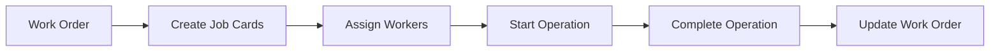
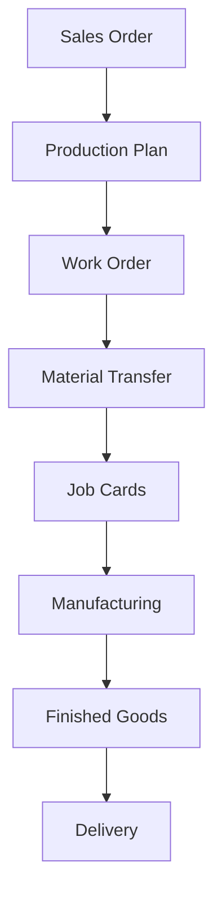

## Overview

The Manufacturing module helps you manage your production operations from planning to execution. It handles bill of materials (BOM), production planning, work orders, shop floor operations, and capacity management.

## Key Features

### Bill of Materials (BOM)

Define the recipe for manufacturing your products:

<CardGroup cols={2}>
  <Card title="Multi-Level BOM" icon="sitemap">
    - Nested sub-assemblies
    - Exploded view
    - BOM comparison
    - Version control
  </Card>
  <Card title="BOM Components" icon="puzzle-piece">
    - Raw materials
    - Operations/routing
    - Scrap items
    - Operating costs
  </Card>
</CardGroup>

## Core Doctypes

<Accordion title="Work Order">
  The central document for production execution.

  ```python
  # From work_order.py
  class WorkOrder(Document):
      status: Literal[
          "Draft",
          "Not Started",
          "In Process",
          "Completed",
          "Stopped",
          "Cancelled"
      ]
  ```

  **Key Features:**
  - BOM-based material planning
  - Operation scheduling
  - Batch size production
  - Material transfer management
  - Job card generation
  - Quality inspection
  - Scrap tracking
  - Capacity planning

  **Workflow:**
  1. Create work order from sales order or production plan
  2. Transfer materials to WIP warehouse
  3. Complete operations via job cards
  4. Manufacture finished goods
  5. Transfer to finished goods warehouse

  <Note>
    Work orders automatically reserve materials and calculate production capacity requirements.
  </Note>
</Accordion>

<Accordion title="BOM (Bill of Materials)">
  The blueprint for manufacturing.

  **BOM Structure:**
  - **Items**: Raw materials and sub-assemblies required
  - **Operations**: Manufacturing steps and routing
  - **Scrap**: Expected scrap/waste
  - **Costs**: Material + operating costs

  **BOM Features:**
  - Multi-level nested BOMs
  - BOM versioning
  - BOM comparison tool
  - Cost rollup calculation
  - Alternate BOM
  - Allow alternative items

  **Costing:**
  ```python
  Total Cost = Material Cost + Operating Cost + Scrap Value
  ```
</Accordion>

<Accordion title="Production Plan">
  Aggregate production planning tool.

  **Planning Methods:**
  - Get items from sales orders
  - Get items from material requests
  - Manual item entry

  **Features:**
  - Multi-item planning
  - Material requirement planning (MRP)
  - Warehouse planning
  - Sub-assembly planning
  - Auto-create work orders
  - Auto-create material requests
  - Download production plan

  **MRP Capabilities:**
  - Check available stock
  - Calculate required quantities
  - Consider sub-assemblies
  - Generate purchase requests
  - Create manufacturing orders
</Accordion>

<Accordion title="Job Card">
  Track operations on the shop floor.

  **Purpose:**
  - Record time spent on operations
  - Track worker allocation
  - Capture production quantities
  - Record downtime
  - Quality verification

  **Time Tracking:**
  - Start/stop timestamps
  - Employee assignment
  - Actual vs planned time
  - Time-based costing

  **Job Card Types:**
  - Normal operations
  - Sub-operation
  - Corrective operations
</Accordion>

## Workstation Management

Define and manage production resources:

### Workstation Setup

<CardGroup cols={2}>
  <Card title="Capacity Planning" icon="gauge">
    - Working hours
    - Number of shifts
    - Holiday calendar
    - Efficiency percentage
  </Card>
  <Card title="Cost Tracking" icon="dollar-sign">
    - Hourly operating cost
    - Electricity cost
    - Maintenance cost
    - Labor cost
  </Card>
</CardGroup>

### Workstation Types

- **Workstation**: Individual machine/station
- **Workstation Type**: Group similar workstations
- **Cost tracking**: Operating component-wise costs

## Production Planning

Plan production efficiently:

<Steps>
  <Step title="Create Production Plan">
    Add items to produce based on sales orders or forecasts
  </Step>
  <Step title="Get Material Requirements">
    System calculates required raw materials using BOM
  </Step>
  <Step title="Check Stock">
    Verify available stock vs required
  </Step>
  <Step title="Create Work Orders">
    Generate work orders for items and sub-assemblies
  </Step>
  <Step title="Create Material Requests">
    Generate purchase requests for shortage items
  </Step>
</Steps>

## Routing and Operations

Define manufacturing process steps:

### Operation Details

- **Operation name**: Process step
- **Workstation**: Where operation is performed
- **Operation time**: Standard time required
- **Batch size**: For time calculation
- **Operating cost**: Cost per operation

### Routing Template

Create reusable routing:

```python
# Example routing
Operation 1: Cutting → Workstation: Cutting Machine → 10 mins
Operation 2: Drilling → Workstation: Drill Press → 15 mins
Operation 3: Assembly → Workstation: Assembly Line → 20 mins
Operation 4: Quality Check → Workstation: QC Station → 5 mins
```

<Tip>
  Operations can have sub-operations for more detailed tracking and costing.
</Tip>

## Material Planning (MRP)

Material Requirements Planning:

### MRP Process

1. **Calculate gross requirement**: Based on production plan
2. **Check available stock**: Current inventory levels
3. **Consider safety stock**: Minimum buffer required
4. **Calculate net requirement**: Gross - available - ordered
5. **Generate material requests**: For shortage items

### Multi-Level Planning

<Note>
  MRP automatically plans for sub-assemblies by exploding multi-level BOMs.
</Note>

## Shop Floor Control

Manage production floor operations:

### Job Card Workflow



### Time Tracking

- **Planned time**: From BOM operation
- **Actual time**: Recorded via job card
- **Variance**: Efficiency analysis
- **Downtime**: Track non-productive time

## Production Costing

Accurate cost calculation:

### Cost Components

| Component | Calculation |
|-----------|-------------|
| **Material Cost** | Sum of BOM item costs |
| **Operating Cost** | Operation time × hourly rate |
| **Scrap Value** | Deducted from total cost |
| **Additional Costs** | Custom charges |

### Valuation Method

- **Standard costing**: Fixed BOM cost
- **Actual costing**: Based on actual consumption

## Quality Management

Integrate quality checks:

### Inspection Points

- **In-process**: During manufacturing
- **First article**: Initial piece inspection
- **Final inspection**: Before completion

### Quality Parameters

- Define quality parameters in BOM
- Record readings in job card
- Accept/reject based on criteria
- Block completion on rejection

## Manufacturing Reports

<Accordion title="Work Order Summary">
  Overview of all work orders:
  - Status-wise summary
  - Pending quantity
  - Completion percentage
  - Delivery delays
</Accordion>

<Accordion title="Production Analytics">
  Visual production insights:
  - Monthly production trends
  - Item-wise production
  - Workstation utilization
  - Efficiency analysis
</Accordion>

<Accordion title="BOM Stock Report">
  Material availability for production:
  - BOM-wise stock check
  - Producible quantity
  - Shortage items
  - Sub-assembly availability
</Accordion>

<Accordion title="Job Card Summary">
  Operation tracking:
  - Operation-wise time
  - Worker productivity
  - Workstation efficiency
  - Pending operations
</Accordion>

<Accordion title="Downtime Analysis">
  Track production losses:
  - Machine downtime
  - Downtime reasons
  - Impact on production
  - Workstation-wise analysis
</Accordion>

## Capacity Planning

Optimize production capacity:

### Capacity Calculation

```python
Daily Capacity = (Working Hours × 60) / Operation Time per Unit
Monthly Capacity = Daily Capacity × Working Days
```

### Capacity Planning Report

- **Available capacity**: Based on workstation hours
- **Required capacity**: From work orders
- **Capacity utilization**: Used vs available
- **Overload detection**: Capacity shortfalls

<Note>
  System warns if work orders exceed available workstation capacity.
</Note>

## Subcontracting

Outsource manufacturing operations:

### Subcontracting Process

<Steps>
  <Step title="Purchase Order">
    Create PO with subcontracted items
  </Step>
  <Step title="Transfer Materials">
    Send raw materials to subcontractor
  </Step>
  <Step title="Receive Goods">
    Receive finished/processed items
  </Step>
  <Step title="Accounting">
    System handles cost allocation automatically
  </Step>
</Steps>

**Cost Tracking:**
- Material cost (transferred items)
- Service cost (subcontracting charges)
- Total landed cost

## Alternative Items

Handle material substitutions:

**Features:**
- Define alternative items in BOM
- Allow alternative during material transfer
- Automatic suggestion on shortage
- Cost variance tracking

## Scrap Management

Track production waste:

### Scrap Items

- Define expected scrap in BOM
- Record actual scrap in work order
- Scrap valuation
- Scrap item creation
- Variance analysis

## Batch Production

Produce in batches:

**Features:**
- Define batch size in work order
- Multiple batches in single work order
- Batch-wise material consumption
- Batch number auto-generation

## Manufacturing Settings

Configure module behavior:

| Setting | Description |
|---------|-------------|
| **Default WIP Warehouse** | Work-in-progress stock location |
| **Default FG Warehouse** | Finished goods warehouse |
| **Backflush Raw Materials** | Auto-consume materials on completion |
| **Material Transfer for Manufacture** | Require explicit material transfer |
| **Update BOM Cost Automatically** | Auto-update on rate changes |
| **Time Between Operations** | Default wait time (minutes) |
| **Over Production Allowance** | Percentage allowed |

## Make-to-Order vs Make-to-Stock

<CardGroup cols={2}>
  <Card title="Make-to-Order" icon="cart-shopping">
    - Produce based on sales orders
    - No finished goods stock
    - Custom products
    - Link to customer order
  </Card>
  <Card title="Make-to-Stock" icon="boxes">
    - Produce for inventory
    - Based on forecasts
    - Standard products
    - Faster delivery
  </Card>
</CardGroup>

## Production Workflow

### Standard Manufacturing Flow



<Tip>
  The manufacturing module integrates with sales, purchasing, and stock to provide end-to-end production visibility and control.
</Tip>
