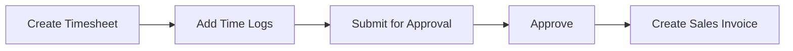
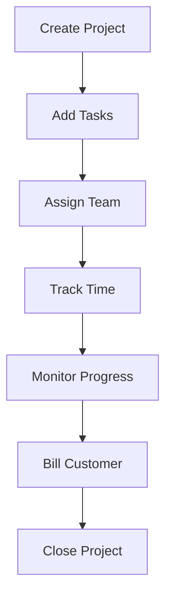

## Overview

The Projects module helps you plan, track, and manage projects effectively. It provides tools for task management, time tracking, resource allocation, project costing, and billing.

## Key Features

### Project Management

Comprehensive project tracking capabilities:

<CardGroup cols={2}>
  <Card title="Project Planning" icon="diagram-project">
    - Task breakdown
    - Timeline management
    - Dependencies
    - Milestones
  </Card>
  <Card title="Resource Management" icon="users">
    - Team allocation
    - Workload tracking
    - Availability management
    - Skill-based assignment
  </Card>
</CardGroup>

## Core Doctypes

<Accordion title="Project">
  The main container for project-related activities.

  ```python
  # From project.py
  class Project(Document):
      status: Literal[
          "Open",
          "Completed",
          "Cancelled"
      ]
      priority: Literal[
          "Low",
          "Medium",
          "High"
      ]
      percent_complete_method: Literal[
          "Manual",
          "Task Completion",
          "Task Progress",
          "Task Weight"
      ]
  ```

  **Project Features:**
  - Project timeline (start and end dates)
  - Customer linkage
  - Cost center allocation
  - Project team members
  - Progress tracking
  - Costing and billing
  - Email notifications
  - Sales order integration

  <Note>
    Projects can be linked to sales orders for tracking project-based sales.
  </Note>
</Accordion>

<Accordion title="Task">
  Individual work items within a project.

  **Task Attributes:**
  - Subject and description
  - Project assignment
  - Start and end dates
  - Expected time
  - Priority (Low, Medium, High)
  - Status (Open, Working, Pending Review, Completed, Cancelled)
  - Parent task (for sub-tasks)
  - Dependencies
  - Progress percentage

  **Task Management:**
  - Assign to team members
  - Set dependencies
  - Track time via timesheet
  - Add comments and attachments
  - Email notifications
  - Task templates
</Accordion>

<Accordion title="Timesheet">
  Record time spent on projects and tasks.

  **Features:**
  - Multi-task time logging
  - Billable/non-billable hours
  - Hourly rates
  - Employee assignment
  - Activity type
  - Time-based costing
  - Billing integration
  - Approval workflow

  **Billing:**
  - Create sales invoice from timesheet
  - Activity-based billing rates
  - Customer-specific rates
  - Billable amount calculation
</Accordion>

<Accordion title="Project Template">
  Standardize project setup.

  **Template Components:**
  - Pre-defined tasks
  - Task dependencies
  - Milestones
  - Standard timeline
  - Default team

  **Benefits:**
  - Faster project creation
  - Consistency across projects
  - Best practices replication
  - Reduced planning time
</Accordion>

## Task Management

Efficient task tracking and execution:

### Task Hierarchy

<Steps>
  <Step title="Project Level">
    Overall project container
  </Step>
  <Step title="Parent Tasks">
    Major project phases or deliverables
  </Step>
  <Step title="Child Tasks">
    Detailed work items under parent tasks
  </Step>
  <Step title="Sub-Tasks">
    Granular breakdown of work
  </Step>
</Steps>

### Task Dependencies

Define task relationships:

- **Depends On**: Task that must be completed first
- **Finish to Start**: Dependent task starts after predecessor
- **Automatic updates**: Cascading date changes
- **Critical path**: Identify bottleneck tasks

<Tip>
  Use task dependencies to automatically adjust project timeline when delays occur.
</Tip>

## Time Tracking

Accurate time recording and billing:

### Timesheet Entry

**Methods:**
1. **Manual entry**: Fill time log details
2. **Timer**: Start/stop timer for tasks
3. **Bulk entry**: Add multiple time logs

### Time Log Details

| Field | Description |
|-------|-------------|
| **Activity Type** | Type of work (Design, Development, Testing) |
| **Project** | Associated project |
| **Task** | Specific task worked on |
| **Hours** | Time spent |
| **Billable** | Whether time can be billed |
| **Billing Rate** | Hourly rate for billing |

### Timesheet Workflow



## Project Costing

Track project profitability:

### Cost Components

<CardGroup cols={2}>
  <Card title="Direct Costs" icon="calculator">
    - Employee time (timesheets)
    - Material consumption
    - External services
    - Equipment usage
  </Card>
  <Card title="Revenue" icon="chart-line">
    - Billed amount
    - Sales orders
    - Sales invoices
    - Budget vs actual
  </Card>
</CardGroup>

### Costing Reports

<Accordion title="Project Profitability">
  Calculate project margin:
  ```python
  Total Revenue = Sales Orders + Sales Invoices
  Total Cost = Timesheet Cost + Purchase Cost + Expense Claims
  Gross Margin = Total Revenue - Total Cost
  Margin % = (Gross Margin / Total Revenue) × 100
  ```
</Accordion>

<Accordion title="Cost Tracking">
  Monitor costs in real-time:
  - Estimated vs actual costs
  - Budget variance
  - Cost center allocation
  - Purchase invoice linkage
  - Expense claim integration
</Accordion>

## Project Billing

Flexible billing options:

### Billing Methods

1. **Time and Material**: Bill based on hours and expenses
2. **Fixed Price**: Single lump sum or milestones
3. **Retainer**: Monthly fixed billing
4. **Mixed**: Combination of methods

### Billing Workflow

<Steps>
  <Step title="Record Time & Expenses">
    Log timesheets and expense claims
  </Step>
  <Step title="Review Billable Items">
    Verify billable time and expenses
  </Step>
  <Step title="Create Sales Invoice">
    Generate invoice from timesheet
  </Step>
  <Step title="Track Payments">
    Monitor payment against invoices
  </Step>
</Steps>

<Note>
  Sales invoices can be automatically created from approved timesheets with one click.
</Note>

## Activity Types

Categorize work activities:

**Common Activity Types:**
- Planning
- Design
- Development
- Testing
- Documentation
- Meeting
- Training
- Support

**Activity Cost:**
- Define hourly rates per activity
- Employee-specific rates
- Customer-specific rates
- Automatic cost calculation

## Project Reports

<Accordion title="Project Summary">
  High-level project overview:
  - Project status
  - Completion percentage
  - Estimated vs actual time
  - Cost and billing summary
  - Task completion status
</Accordion>

<Accordion title="Delayed Tasks Summary">
  Identify at-risk items:
  - Tasks past due date
  - Delay duration
  - Responsible person
  - Impact on project timeline
</Accordion>

<Accordion title="Timesheet Billing Summary">
  Billing analysis:
  - Billable vs non-billable hours
  - Employee-wise time
  - Project-wise time
  - Unbilled hours
  - Revenue by activity
</Accordion>

<Accordion title="Daily Timesheet Summary">
  Daily time tracking:
  - Employee attendance
  - Project allocation
  - Time utilization
  - Productivity metrics
</Accordion>

<Accordion title="Project-wise Stock Tracking">
  Material usage by project:
  - Items consumed
  - Stock transfers
  - Purchase against project
  - Inventory costs
</Accordion>

## Gantt Chart

Visual project timeline:

**Features:**
- Task timeline visualization
- Dependency arrows
- Critical path highlighting
- Progress indication
- Drag-and-drop rescheduling
- Milestone markers

<Tip>
  Use the Gantt chart to quickly identify schedule conflicts and resource over-allocation.
</Tip>

## Project Templates

Standardize project execution:

### Template Setup

1. **Define standard tasks**: Create template tasks
2. **Set dependencies**: Link related tasks
3. **Add milestones**: Mark important phases
4. **Assign team**: Default team members
5. **Set durations**: Standard time estimates

### Using Templates

- Select template when creating project
- System copies all tasks automatically
- Dates calculated based on project start
- Customize as needed

## Resource Management

Manage team allocation:

### Team Assignment

- **Project users**: Define project team
- **Task assignment**: Allocate specific tasks
- **Workload view**: See employee utilization
- **Availability check**: Prevent over-allocation

### Capacity Planning

<Note>
  Track employee capacity across multiple projects to prevent resource conflicts.
</Note>

## Project Updates

Communicate project status:

**Update Features:**
- Regular status updates
- Automated email notifications
- Frequency settings (Daily, Weekly)
- Customizable content
- Stakeholder distribution

## Expense Claims

Track project expenses:

- Link expense claims to projects
- Reimbursable expenses
- Approval workflow
- Include in project costing
- Bill to customer if applicable

## Project Settings

Configure module behavior:

| Setting | Description |
|---------|-------------|
| **Project Naming** | Auto-naming series |
| **Default Priority** | Default task priority |
| **Ignore Employee Time Overlap** | Allow concurrent time logs |
| **Ignore Mandatory Time Logs** | Submit timesheet without time logs |

## Project Integration

Seamless integration with other modules:

### Sales Integration

- Link project to sales order
- Track project-based sales
- Milestone billing
- Delivery against project

### Purchase Integration

- Purchase against project
- Track project expenses
- Vendor management
- Material requests for projects

### Stock Integration

- Material issue to project
- Project-wise stock tracking
- Inventory consumption
- Stock reconciliation

## Project Workflow

### Standard Project Flow



### Agile Project Flow

<Steps>
  <Step title="Sprint Planning">
    Create sprint with task list
  </Step>
  <Step title="Daily Standups">
    Update task status and time logs
  </Step>
  <Step title="Sprint Review">
    Demonstrate completed work
  </Step>
  <Step title="Sprint Retrospective">
    Review and improve process
  </Step>
</Steps>

<Tip>
  The Projects module provides complete visibility into project health, resource utilization, and profitability in real-time.
</Tip>
