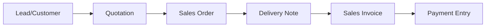
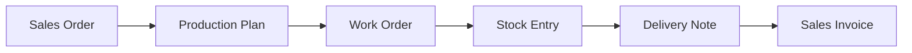

## Overview

The Selling module handles the complete sales cycle from quotation to delivery. It helps you manage customers, create sales orders, track deliveries, and analyze sales performance.

## Key Features

### Customer Management

Build and maintain strong customer relationships:

<CardGroup cols={2}>
  <Card title="Customer Database" icon="users">
    - Contact information
    - Credit limits
    - Payment terms
    - Customer groups
  </Card>
  <Card title="Customer Portal" icon="browser">
    Customers can view orders, invoices, and make payments online
  </Card>
</CardGroup>

## Core Doctypes

<Accordion title="Sales Order">
  The backbone of the sales process - customer orders for goods or services.

  ```python
  # From sales_order.py
  class SalesOrder(SellingController):
      status: Literal[
          "Draft",
          "To Deliver and Bill",
          "To Bill",
          "To Deliver",
          "Completed",
          "Cancelled",
          "Closed",
          "On Hold"
      ]
      billing_status: Literal[
          "Not Billed",
          "Fully Billed",
          "Partly Billed",
          "Closed"
      ]
  ```

  **Key Features:**
  - Multi-item ordering
  - Partial delivery and billing
  - Delivery date tracking
  - Reservation of stock
  - Credit limit checking
  - Production planning integration
  - Drop shipping support

  <Note>
    Sales orders automatically check stock availability and can trigger production or purchase based on settings.
  </Note>
</Accordion>

<Accordion title="Quotation">
  Send professional quotes to customers and prospects.

  **Features:**
  - Multiple items and pricing tiers
  - Valid until date
  - Terms and conditions
  - Print designer templates
  - Email directly to customer
  - Convert to Sales Order
  - Track quotation status (Sent, Ordered, Lost)

  **Lost Quotation Analysis:**
  - Track lost reasons
  - Competitor information
  - Lost quotation reports
</Accordion>

<Accordion title="Delivery Note">
  Record goods shipped to customers.

  **Capabilities:**
  - Batch and serial number tracking
  - Barcode scanning
  - Print packing slips
  - E-way bill generation
  - Installation note creation
  - Return handling

  **Impact:**
  - Reduces stock levels
  - Updates sales order status
  - Creates accounting entries (if perpetual inventory)
  - Triggers invoicing workflow
</Accordion>

<Accordion title="Sales Invoice">
  Bill customers and record revenue.

  **Features:**
  - POS mode for retail
  - Multiple payment modes
  - Advance payment allocation
  - Payment request generation
  - E-invoicing
  - Credit note/debit note
  - Installment invoicing
  - Deferred revenue booking
</Accordion>

## Quotation to Sales Order Flow

<Steps>
  <Step title="Create Quotation">
    Generate quote with items, pricing, and terms
  </Step>
  <Step title="Send to Customer">
    Email quotation or share via customer portal
  </Step>
  <Step title="Follow Up">
    Track quotation status and follow up
  </Step>
  <Step title="Convert to Sales Order">
    One-click conversion when customer accepts
  </Step>
</Steps>

## Pricing and Discounts

### Pricing Rules

Create flexible pricing rules for different scenarios:

<CardGroup cols={2}>
  <Card title="Customer-Based" icon="user">
    - Customer-wise pricing
    - Customer group discounts
    - Territory-based pricing
  </Card>
  <Card title="Product-Based" icon="box">
    - Item-wise pricing
    - Item group discounts
    - Brand-based pricing
  </Card>
  <Card title="Quantity-Based" icon="hashtag">
    - Volume discounts
    - Tiered pricing
    - Bundle pricing
  </Card>
  <Card title="Promotional" icon="tags">
    - Time-bound offers
    - Campaign pricing
    - Seasonal discounts
  </Card>
</CardGroup>

### Price Lists

Manage multiple price lists:

- **Standard Selling**: Default customer prices
- **Retail**: POS and walk-in customers
- **Wholesale**: Bulk buyers
- **Export**: International customers
- **Campaign-specific**: Promotional pricing

<Tip>
  Pricing rules can be combined, and the system automatically applies the best price for the customer.
</Tip>

## Product Bundle

Sell multiple items as a single product:

**Use Cases:**
- Gift sets
- Combo offers
- Starter kits
- Subscription boxes

**Features:**
- Define bundle components
- Single price for bundle
- Automatic stock handling
- BOM integration

<Note>
  When a product bundle is sold, the system automatically reserves or reduces stock of component items.
</Note>

## Sales Team and Commission

Track sales performance and manage commissions:

### Sales Team Setup

- Assign sales persons to transactions
- Define contribution percentage
- Track individual performance
- Calculate commissions automatically

### Commission Structure

```python
# Commission calculation
- Percentage of sales value
- Tiered commission rates
- Target-based incentives
- Product category-wise rates
```

## Territory Management

Organize sales operations geographically:

- **Hierarchical structure**: Country → State → City
- **Territory-wise targets**: Set sales goals
- **Territory managers**: Assign ownership
- **Performance tracking**: Compare actual vs target

## Sales Analytics

Gain insights into sales performance:

<Accordion title="Sales Analytics Report">
  Visual dashboard showing:
  - Monthly/quarterly trends
  - Top customers
  - Top items
  - Territory-wise breakdown
  - Sales person performance
</Accordion>

<Accordion title="Sales Order Analysis">
  Detailed analysis of sales orders:
  - Pending orders
  - Delivery delays
  - Value by customer/item
  - Order aging
</Accordion>

<Accordion title="Customer Acquisition and Loyalty">
  Track customer behavior:
  - New vs repeat customers
  - Customer lifetime value
  - Purchase frequency
  - Churn analysis
</Accordion>

## Sales Partner Management

Manage channel partners and distributors:

**Features:**
- Partner database
- Commission tracking
- Target allocation
- Performance reports
- Portal access

**Partner Types:**
- Distributors
- Retailers
- Affiliate partners
- Sales agents

## Point of Sale (POS)

Retail sales interface for quick billing:

<CardGroup cols={2}>
  <Card title="Quick Billing" icon="cash-register">
    - Fast item selection
    - Barcode scanning
    - Quick payment
    - Receipt printing
  </Card>
  <Card title="POS Features" icon="store">
    - Multiple payment modes
    - Cash management
    - Offline mode
    - Customer lookup
  </Card>
</CardGroup>

### POS Invoice Workflow

1. **Select items**: Scan barcode or search
2. **Apply discounts**: Automatic pricing rules
3. **Collect payment**: Cash, card, or multiple modes
4. **Print receipt**: Instant receipt generation
5. **Submit**: Auto-submit and update stock

<Tip>
  POS mode can work offline and sync transactions when connectivity is restored.
</Tip>

## Installation Note

Track product installation at customer sites:

- Link to delivery note
- Installation date and time
- Customer acceptance
- Serial numbers installed
- Installation team details

## Item-wise Sales History

View complete sales history for any item:

- Past sales transactions
- Price trends
- Customer list
- Quantity patterns
- Seasonal trends

## Selling Settings

Customize module behavior:

| Setting | Description |
|---------|-------------|
| **Customer Naming** | Auto or manual naming |
| **Campaign Required** | Make campaign mandatory |
| **SO Required** | Require sales order for delivery |
| **DN Required** | Require delivery note for invoice |
| **Default Customer Group** | Auto-assign group |
| **Close Opportunity** | Auto-close on quotation |
| **Default Valid Until** | Quotation validity days |

## Credit Management

Control customer credit exposure:

### Credit Limit Setup

- Customer-wise limits
- Customer group limits
- Credit days/period
- Grace period

### Credit Control

<Note>
  System prevents order submission if credit limit is exceeded, with option to override based on permissions.
</Note>

**Actions:**
- Warning on exceeding limit
- Stop transactions
- Bypass based on role

## Blanket Orders

Manage rate contracts with customers:

- Annual agreements
- Fixed pricing for period
- Maximum quantity limits
- Order against contract

## Payment Terms

Define flexible payment schedules:

- **Payment terms template**: Reusable terms
- **Milestone-based**: Payment on milestones
- **Installments**: Split into multiple payments
- **Advance + balance**: Partial advance payment

## Key Workflows

### Standard Sales Flow



### Make-to-Order Flow



<Tip>
  The selling module integrates with CRM for lead-to-order conversion and with manufacturing for make-to-order scenarios.
</Tip>
