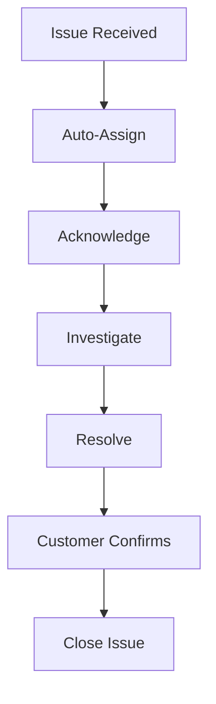

## Overview

The Support module helps you manage customer service operations effectively. Track customer issues, manage warranties, maintain service level agreements, and analyze support performance.

## Key Features

### Issue Management

Streamline customer support operations:

<CardGroup cols={2}>
  <Card title="Multi-Channel" icon="inbox">
    - Email integration
    - Web portal
    - Phone support
    - Manual entry
  </Card>
  <Card title="Tracking" icon="chart-line">
    - Status tracking
    - Priority management
    - SLA monitoring
    - Resolution tracking
  </Card>
</CardGroup>

## Core Doctypes

<Accordion title="Issue">
  The central record for customer support tickets.

  ```python
  # From issue.py
  class Issue(Document):
      status: Literal[
          "Open",
          "Replied",
          "On Hold",
          "Resolved",
          "Closed"
      ]
      agreement_status: Literal[
          "First Response Due",
          "Resolution Due",
          "Fulfilled",
          "Failed"
      ]
  ```

  **Issue Details:**
  - Subject and description
  - Customer/lead linkage
  - Priority (Low, Medium, High, Critical)
  - Issue type
  - Status tracking
  - Raised by (customer email)
  - Opening date and time
  - Resolution details

  **SLA Tracking:**
  - Service Level Agreement
  - First response time
  - Resolution time
  - Response by date
  - SLA status
  - On hold time

  <Note>
    Issues can be automatically created from customer emails when email integration is configured.
  </Note>
</Accordion>

<Accordion title="Service Level Agreement (SLA)">
  Define and enforce service commitments.

  **SLA Components:**
  - Customer/customer group
  - Priority levels
  - Response time targets
  - Resolution time targets
  - Service days and hours
  - Holiday calendar
  - Support team

  **Priority Configuration:**
  - Define multiple priorities
  - Set response time for each
  - Set resolution time for each
  - Different SLAs for different priorities

  **Working Hours:**
  - Define support hours
  - Set working days
  - Link holiday list
  - SLA time calculated only during working hours
</Accordion>

<Accordion title="Warranty Claim">
  Track warranty-related service requests.

  **Warranty Details:**
  - Serial number linkage
  - Issue date
  - Complaint description
  - Resolution details
  - Service person assignment
  - Status (Open, Work in Progress, Completed, Cancelled)

  **Warranty Validation:**
  - Check serial number warranty
  - Verify warranty expiry
  - AMC/CMC verification
  - Warranty terms

  **Service Tracking:**
  - Visited date
  - Service address
  - Resolution date
  - Customer feedback
</Accordion>

<Accordion title="Issue Type">
  Categorize issues for better tracking.

  **Common Issue Types:**
  - Technical Issue
  - Billing Query
  - Feature Request
  - Bug Report
  - Product Inquiry
  - Complaint
  - Service Request

  **Benefits:**
  - Better routing
  - Type-wise analysis
  - Specialized handling
  - Performance metrics
</Accordion>

## Email Integration

Automate issue creation from emails:

### Email Account Setup

<Steps>
  <Step title="Configure Email Account">
    Set up support email in ERPNext
  </Step>
  <Step title="Enable Issue Creation">
    Configure to create issues from emails
  </Step>
  <Step title="Auto-Reply">
    Set up acknowledgment templates
  </Step>
  <Step title="Thread Tracking">
    Maintain email conversation in issue
  </Step>
</Steps>

### Email Features

- **Auto-creation**: Issues created from incoming emails
- **Threading**: Replies linked to same issue
- **Customer detection**: Auto-link to customer
- **Auto-assign**: Route to support team
- **Email templates**: Standardized responses

<Tip>
  Configure support@yourcompany.com to automatically create and track issues from customer emails.
</Tip>

## Service Level Agreements (SLA)

Manage customer expectations:

### SLA Setup

**Configuration:**
1. Define service priorities
2. Set response and resolution times
3. Configure working hours
4. Link holiday calendar
5. Apply to customers/groups

### SLA Monitoring

<CardGroup cols={2}>
  <Card title="Response Time" icon="clock">
    - First response SLA
    - Time to first reply
    - Auto-alerts on breach
    - Team performance
  </Card>
  <Card title="Resolution Time" icon="check">
    - Time to resolve
    - Resolution SLA
    - Breach notifications
    - Escalation rules
  </Card>
</CardGroup>

### SLA Status

- **First Response Due**: Awaiting initial response
- **Resolution Due**: Resolution time running
- **Fulfilled**: Met SLA targets
- **Failed**: Breached SLA

### On Hold Time

Pause SLA when waiting for customer:

- **Pause reasons**: Waiting for customer response
- **On hold tracking**: Time spent on hold
- **SLA calculation**: Excludes hold time
- **Resume**: Auto-resume on customer reply

<Note>
  SLA timers only count time during configured support hours, excluding holidays and non-working days.
</Note>

## Issue Assignment

Route issues to the right team:

### Auto-Assignment

**Assignment Rules:**
- Round-robin distribution
- Based on issue type
- Based on customer
- Based on priority
- Load balancing

### Manual Assignment

- Assign to user/team
- Reassign if needed
- Assign via email
- Bulk assignment

## Customer Portal

Empower customers with self-service:

### Portal Features

<CardGroup cols={2}>
  <Card title="Create Issues" icon="plus">
    - Submit new issues
    - Attach files
    - Track submission
  </Card>
  <Card title="Track Issues" icon="list">
    - View all issues
    - Check status
    - Read responses
    - Add comments
  </Card>
</CardGroup>

### Knowledge Base

Reduce support volume with self-help:

- FAQs
- How-to articles
- Video tutorials
- Documentation links
- Search functionality

## Priority Management

Prioritize support requests:

### Priority Levels

| Priority | Response Time | Resolution Time | Use Case |
|----------|---------------|-----------------|----------|
| **Low** | 48 hours | 7 days | General inquiries |
| **Medium** | 24 hours | 3 days | Standard issues |
| **High** | 4 hours | 1 day | Important problems |
| **Critical** | 1 hour | 4 hours | System down |

### Priority Rules

- Auto-priority based on keywords
- Customer-specific priorities
- Escalation rules
- Priority override

<Tip>
  Set appropriate response and resolution times for each priority level based on your support capacity.
</Tip>

## Support Analytics

Measure and improve support performance:

<Accordion title="Issue Summary">
  High-level support metrics:
  - Total issues
  - Status distribution
  - Priority breakdown
  - Average resolution time
  - SLA compliance rate
</Accordion>

<Accordion title="Issue Analytics">
  Detailed issue analysis:
  - Time-series trends
  - Issue type distribution
  - Customer-wise issues
  - Agent performance
  - Resolution patterns
</Accordion>

<Accordion title="First Response Time for Issues">
  Track response speed:
  - Average first response time
  - Agent-wise response times
  - Response time trends
  - SLA compliance
  - Best and worst performers
</Accordion>

<Accordion title="Support Hour Distribution">
  Analyze support patterns:
  - Hour-wise issue volume
  - Peak support hours
  - Team capacity planning
  - Shift optimization
</Accordion>

## Warranty Management

Track warranty and service contracts:

### Serial Number Integration

- **Warranty tracking**: Link to serial numbers
- **Expiry alerts**: Notify before warranty ends
- **AMC/CMC**: Annual/comprehensive maintenance contracts
- **Service history**: Complete service record

### Warranty Claims Process

<Steps>
  <Step title="Customer Reports Issue">
    Customer contacts support with serial number
  </Step>
  <Step title="Verify Warranty">
    System checks warranty status automatically
  </Step>
  <Step title="Create Warranty Claim">
    If valid, create warranty claim
  </Step>
  <Step title="Schedule Service">
    Assign service person and schedule visit
  </Step>
  <Step title="Resolve & Close">
    Complete service and close claim
  </Step>
</Steps>

## Issue Resolution

Track resolution process:

### Resolution Workflow

1. **Issue received**: Customer reports problem
2. **Acknowledged**: Auto-response sent
3. **Investigating**: Team analyzes issue
4. **In progress**: Working on solution
5. **Resolved**: Solution provided
6. **Closed**: Customer confirms resolution

### Resolution Details

- **Resolution description**: How issue was resolved
- **Resolution date**: When resolved
- **Resolution time**: Total time taken
- **Customer satisfaction**: Feedback rating

## Communication History

Maintain complete interaction record:

**Tracked Communications:**
- Email threads
- Phone calls
- Comments
- Status changes
- Assignment changes
- Attachments

**Timeline View:**
- Chronological display
- All interactions visible
- Complete context
- Audit trail

## Support Settings

Configure support operations:

| Setting | Description |
|---------|-------------|
| **Issue Closing Status** | Status that closes issue |
| **Close Issue After Days** | Auto-close resolved issues |
| **Search Source for Help** | Knowledge base integration |
| **Email Template** | Default email responses |
| **Support Portal** | Enable customer portal |

## Issue Templates

Standardize responses:

**Template Types:**
- Acknowledgment emails
- Resolution templates
- Follow-up messages
- Closing notifications
- SLA breach alerts

## Escalation Rules

Automate issue escalation:

### Escalation Triggers

- **Time-based**: If not resolved in X hours
- **SLA breach**: When SLA violated
- **Priority-based**: High priority auto-escalate
- **Customer-based**: VIP customer escalation

### Escalation Actions

- Assign to manager
- Increase priority
- Send notifications
- Create task

<Note>
  Configure escalation rules to ensure critical issues get immediate attention.
</Note>

## Support Team Management

### Team Structure

- **Support manager**: Team lead
- **Support agents**: Front-line team
- **Specialists**: Technical experts
- **Escalation contacts**: Senior support

### Capacity Planning

- Track agent workload
- Monitor queue length
- Balance assignment
- Identify bottlenecks

## Integration with Other Modules

### CRM Integration

- Link issues to leads
- Track customer issues
- Support history in CRM
- Issue-to-opportunity

### Sales Integration

- Link to sales orders
- Product-specific issues
- Delivery issues
- Invoice queries

### Projects Integration

- Project-related issues
- Implementation support
- Delivery issues
- Milestone dependencies

## Key Metrics

Track support performance:

```python
# Important KPIs
First Response Time = Time from creation to first reply
Average Resolution Time = Total resolution time / Number of issues
SLA Compliance = (Issues within SLA / Total issues) × 100
Customer Satisfaction = Average rating from customers
Issue Backlog = Number of open issues
Reopened Issues = Issues reopened after closure
```

## Support Workflow

### Standard Support Flow



<Tip>
  The Support module helps you deliver excellent customer service with efficient issue tracking, SLA management, and comprehensive analytics.
</Tip>
